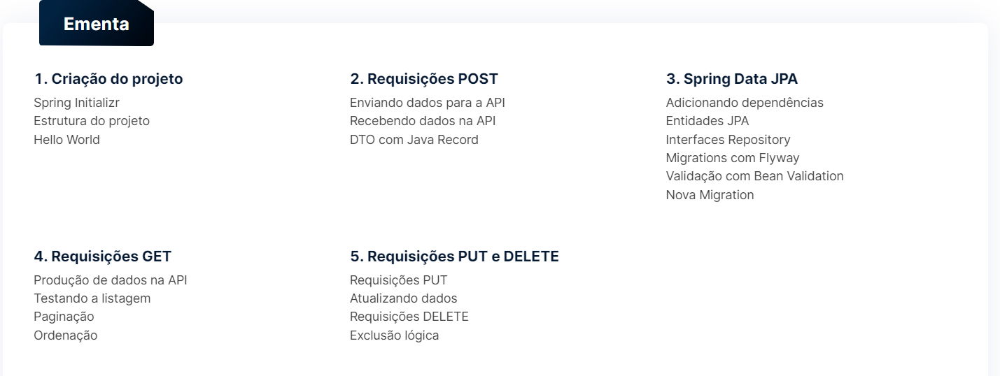
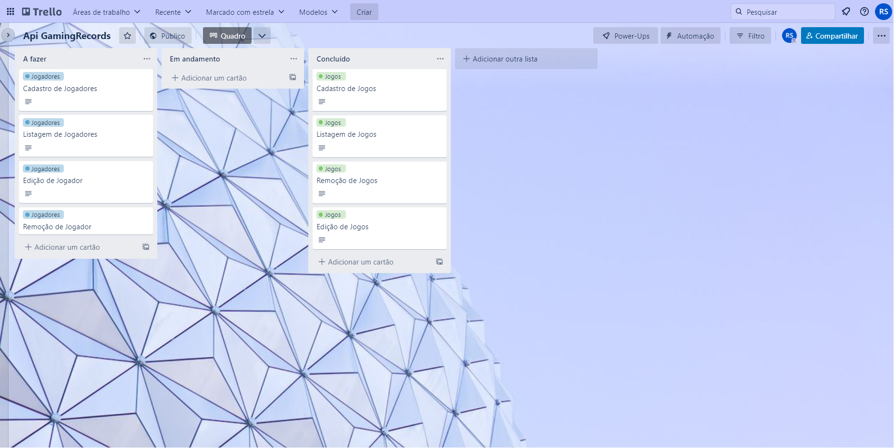
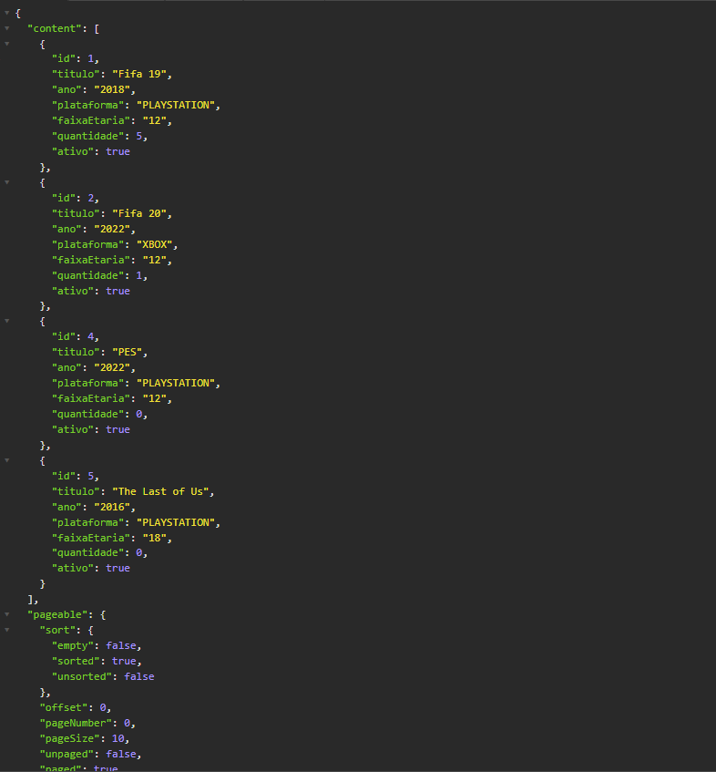
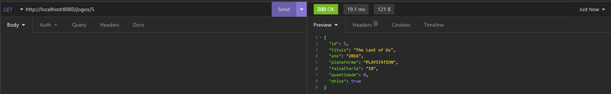
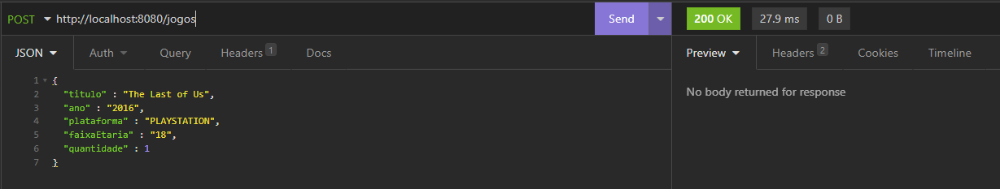
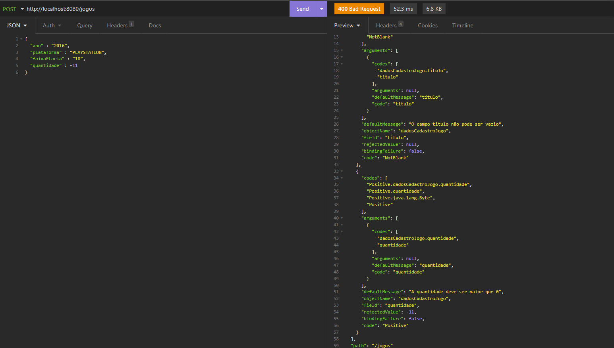
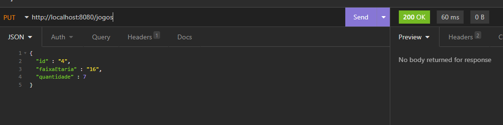
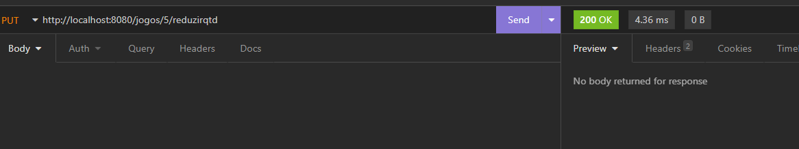
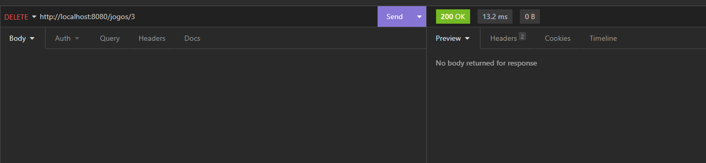

Desenvolvi essa api rest somente com os endpoints para realização de CRUD sem interface gráfica, a fim de aplicar os conceitos que aprendi no curso da alura, fazendo uma versão própria.

Criei um projeto com descrição e requisitos fictícios para organizar meu desenvolvimento.

## Conceitos e Aprendizados
 

*Quadro retirado do painel de apresentação do curso na [alura](https://www.alura.com.br/curso-online-spring-boot-3-desenvolva-api-rest-java)*

## Descrição
Nome **fictício** da empresa: GamingRecords.

Sistema de controle de estoque de jogos que permite que eu possa adicionar, visualizar, editar e remover jogos do estoque. Os jogos podem ser alugados por jogadores o que removerá o jogo do estoque.

Cada jogo possui um titulo, ano, plataforma, faixaEtaria e quantidade.
Cada jogador possui um email, nome, data de nascimento, cpf e endereço.

## Requisitos

A exemplo do que foi visto no curso, criei um quadro no trello para organizar o processo de criação e requisitos, que pode ser acessado aqui [quadro - gamingrecords](https://trello.com/b/nn5rTDqG/api-gamingrecords).

## Aplicação

Como dito anteriormente, esta API tem somente os endpoints para requisições, sem interface gráfica. Então, para testá-la estou utilizando o [insomnia](https://insomnia.rest/download), assim como visto no curso.

Na versão atual, a api tem 6 endpoints:
1. GET /jogos - listar todos jogos ativos ordenados pelo titulo
2. GET /jogos/{id} - listar um jogo pelo seu id se estiver ativo
3. POST /jogos - adicionar um jogo novo através do body da requisição
4. PUT /jogos - editar um jogo através de um body da requisição que contenha seu id
5. PUT /jogos/{id}/reduzir-qtd - reduz a quantidade de um jogo passando seu id pela url, se a quantidade atual for maior que 0
6. DELETE /jogos/{id} - deleta **logicamente** um jogo, ou seja ele é alterado para inativo no bd e não deletado de fato

A seguir mostro como todas as requisições são voltadas no insomnia. Lembrando que também coloquei validações dos atributos inseridos nas requisições, mostrarei abaixo.

### 1 - GET /jogos

### 2 - GET /jogos/{id}

### 3 - POST /jogos 

#### **Utilizando atributos inválido**
Na requisição abaixo coloquei a quantidade negativa e um dos campos obrigatórios (titulo) como nulo, mensagens personalizadas serão voltadas

### 4 - PUT /jogos

*Assim como na requisição post, há algumas validações para os atributos, como not null para o id e apenas números positivos para quantidade*

### 5 - PUT /jogos/{id}/reduzir-qtd

### 6 - GET /jogos

